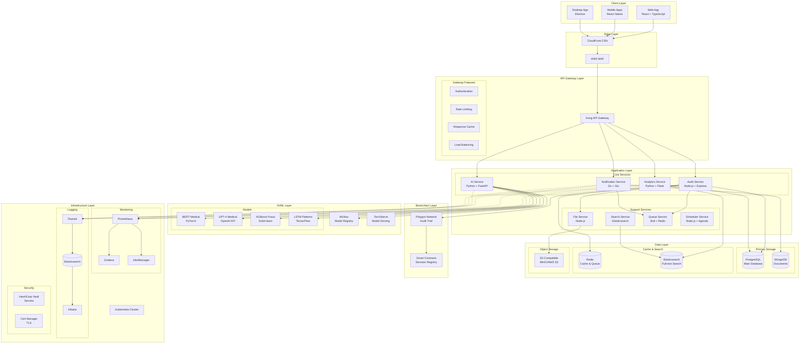
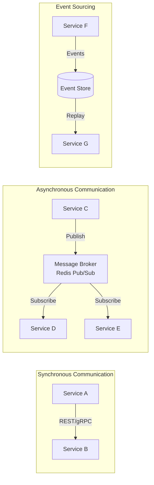
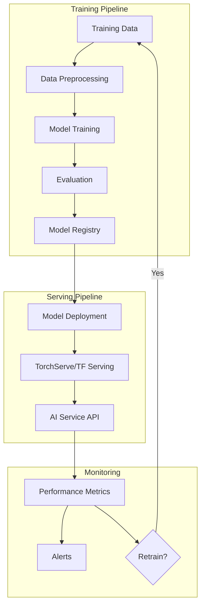
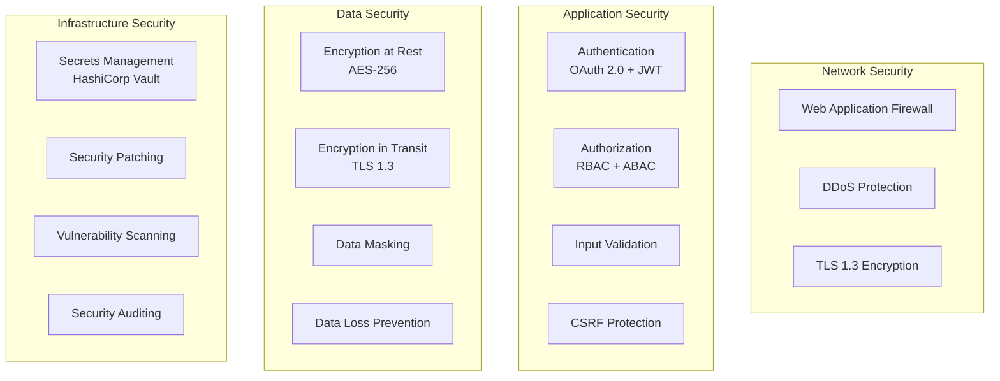
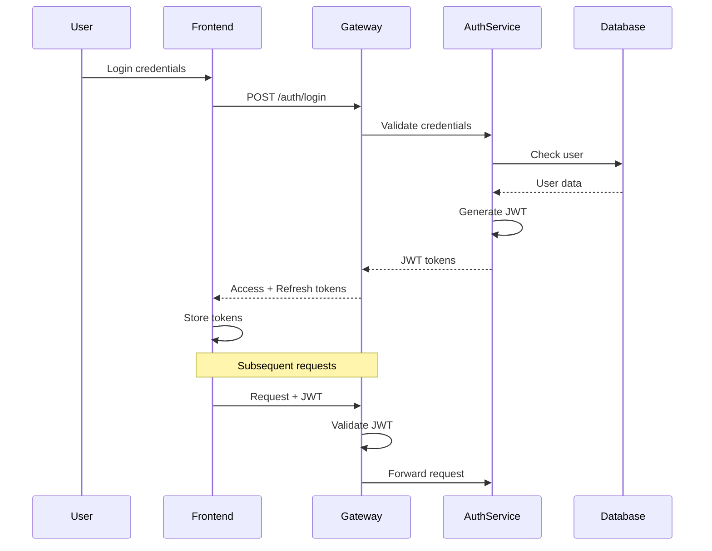
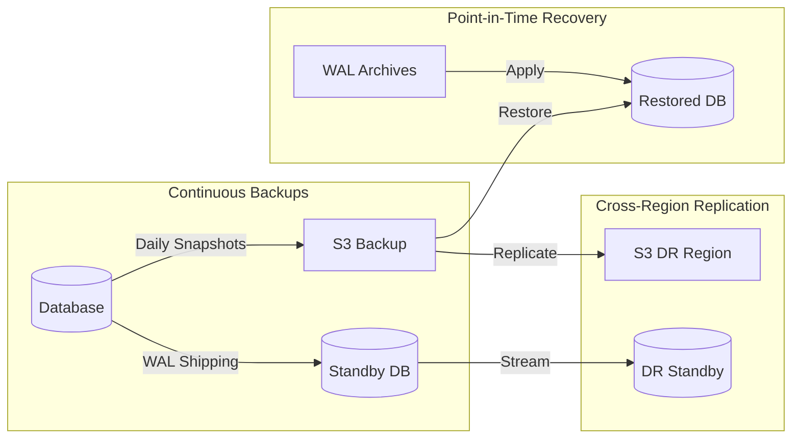

# AUSTA Cockpit Architecture

## Overview

AUSTA Cockpit is a distributed, microservices-based platform designed for high availability, scalability, and performance. The architecture follows cloud-native principles and implements best practices for security, monitoring, and maintainability.

## System Architecture Diagram



## Core Components

### 1. Client Layer

#### Web Application
- **Technology**: React 18 + TypeScript + Vite
- **State Management**: Redux Toolkit + RTK Query
- **UI Framework**: Tailwind CSS + Custom Components
- **Real-time**: Socket.io Client
- **Routing**: React Router v6

#### Mobile Applications
- **Technology**: React Native + TypeScript
- **Platform Support**: iOS 13+ and Android 8+
- **Native Features**: Biometric auth, push notifications, camera
- **State Management**: Redux Toolkit + Redux Persist

#### Desktop Application
- **Technology**: Electron + React
- **Platform Support**: Windows 10+, macOS 10.14+, Ubuntu 18.04+
- **Features**: System tray, auto-updates, native notifications

### 2. API Gateway Layer

#### Kong API Gateway
- **Purpose**: Single entry point for all API requests
- **Features**:
  - JWT Authentication
  - Rate limiting (sliding window)
  - Request/Response transformation
  - API versioning
  - Health checks and circuit breakers
  - Request logging and analytics

**Configuration Example**:
```yaml
services:
  - name: audit-service
    url: http://audit-service:3000
    routes:
      - name: audit-routes
        paths:
          - /api/v1/cases
          - /api/v1/decisions
    plugins:
      - name: jwt
      - name: rate-limiting
        config:
          minute: 60
          hour: 1000
      - name: request-transformer
        config:
          add:
            headers:
              - X-Service-Name:audit
```

### 3. Microservices Architecture

#### Service Communication


#### Audit Service (Node.js + Express)
**Responsibilities**:
- Case lifecycle management
- Decision recording and validation
- Workflow orchestration
- Business rule enforcement
- Blockchain integration

**Key Technologies**:
- Express.js with TypeScript
- Prisma ORM
- Bull for job queues
- Socket.io for real-time updates

**API Structure**:
```typescript
// src/routes/index.ts
app.use('/api/v1/auth', authRoutes);
app.use('/api/v1/cases', authenticate, caseRoutes);
app.use('/api/v1/decisions', authenticate, decisionRoutes);
app.use('/api/v1/users', authenticate, userRoutes);
app.use('/api/v1/webhooks', authenticate, webhookRoutes);
```

#### AI Service (Python + FastAPI)
**Responsibilities**:
- AI model orchestration
- Medical analysis processing
- Fraud detection
- Pattern recognition
- Model versioning and A/B testing

**Architecture**:
```python
# app/main.py
app = FastAPI(title="AUSTA AI Service")

# Model Registry
models = {
    "bert_medical": BERTMedicalModel(),
    "fraud_detector": FraudDetectionModel(),
    "pattern_analyzer": PatternAnalyzer(),
    "gpt4_medical": GPT4MedicalWrapper()
}

# API Endpoints
app.include_router(analysis_router, prefix="/api/v1/analysis")
app.include_router(chat_router, prefix="/api/v1/chat")
app.include_router(models_router, prefix="/api/v1/models")
```

#### Analytics Service (Python + Flask)
**Responsibilities**:
- Real-time metrics processing
- Report generation
- Data aggregation
- Business intelligence
- Predictive analytics

**Data Pipeline**:
```python
# Apache Spark streaming pipeline
spark = SparkSession.builder \
    .appName("AUSTA Analytics") \
    .config("spark.sql.adaptive.enabled", "true") \
    .getOrCreate()

# Stream processing
audit_stream = spark \
    .readStream \
    .format("kafka") \
    .option("kafka.bootstrap.servers", KAFKA_BROKERS) \
    .option("subscribe", "audit-events") \
    .load()
```

#### Notification Service (Go + Gin)
**Responsibilities**:
- Multi-channel notifications (Email, SMS, Push, WhatsApp)
- Template management
- Delivery tracking
- Rate limiting per user/channel

**Architecture**:
```go
// main.go
type NotificationService struct {
    emailProvider    EmailProvider
    smsProvider      SMSProvider
    pushProvider     PushProvider
    whatsappProvider WhatsAppProvider
    templateEngine   TemplateEngine
    deliveryTracker  DeliveryTracker
}

// Route handlers
router.POST("/api/v1/notifications/send", auth, h.SendNotification)
router.GET("/api/v1/notifications/status/:id", auth, h.GetStatus)
router.POST("/api/v1/templates", auth, admin, h.CreateTemplate)
```

### 4. Data Architecture

#### Primary Database (PostgreSQL)
**Schema Design**:
```sql
-- Core tables
CREATE TABLE cases (
    id UUID PRIMARY KEY DEFAULT gen_random_uuid(),
    case_number VARCHAR(50) UNIQUE NOT NULL,
    patient_id UUID NOT NULL,
    procedure_code VARCHAR(20) NOT NULL,
    requested_value DECIMAL(10,2) NOT NULL,
    priority VARCHAR(20) NOT NULL,
    status VARCHAR(20) NOT NULL,
    assigned_to UUID,
    created_at TIMESTAMPTZ DEFAULT NOW(),
    updated_at TIMESTAMPTZ DEFAULT NOW(),
    FOREIGN KEY (patient_id) REFERENCES patients(id),
    FOREIGN KEY (assigned_to) REFERENCES users(id)
);

CREATE TABLE decisions (
    id UUID PRIMARY KEY DEFAULT gen_random_uuid(),
    case_id UUID NOT NULL,
    auditor_id UUID NOT NULL,
    decision VARCHAR(20) NOT NULL,
    justification TEXT NOT NULL,
    authorized_value DECIMAL(10,2),
    ai_confidence FLOAT,
    blockchain_tx VARCHAR(66),
    created_at TIMESTAMPTZ DEFAULT NOW(),
    FOREIGN KEY (case_id) REFERENCES cases(id),
    FOREIGN KEY (auditor_id) REFERENCES users(id)
);

-- Indexes for performance
CREATE INDEX idx_cases_status ON cases(status);
CREATE INDEX idx_cases_assigned_to ON cases(assigned_to);
CREATE INDEX idx_cases_created_at ON cases(created_at DESC);
CREATE INDEX idx_decisions_case_id ON decisions(case_id);
```

#### Document Store (MongoDB)
**Collections**:
- `medical_documents`: Patient medical records and files
- `chat_conversations`: AI chat history
- `audit_logs`: Detailed audit trail
- `templates`: Notification and report templates

**Schema Example**:
```javascript
// medical_documents collection
{
  _id: ObjectId("..."),
  caseId: "123e4567-e89b-12d3-a456-426614174000",
  documentType: "prescription",
  fileName: "prescription_12345.pdf",
  fileSize: 1048576,
  mimeType: "application/pdf",
  s3Key: "documents/2024/01/prescription_12345.pdf",
  metadata: {
    uploadedBy: "user-id",
    uploadedAt: ISODate("2024-01-26T10:30:00Z"),
    tags: ["cardiology", "hypertension"],
    extracted: {
      medications: ["Losartan 50mg", "Aspirin 100mg"],
      prescribedBy: "Dr. João Silva",
      validUntil: ISODate("2024-07-26")
    }
  },
  checksum: "sha256:abcdef123456...",
  encrypted: true
}
```

#### Cache Layer (Redis)
**Usage Patterns**:
```redis
# Session storage
SET session:user123 "{...user_data...}" EX 3600

# API response cache
SET api:cases:pending:page1 "{...cases...}" EX 300

# Rate limiting
INCR rate:api:user123 
EXPIRE rate:api:user123 3600

# Real-time metrics
ZADD metrics:response_time 1674732600 "245"

# Pub/Sub for events
PUBLISH case.updated "{\"caseId\":\"123\",\"status\":\"approved\"}"
```

### 5. AI/ML Architecture

#### Model Management


#### Model Specifications

**BERT Medical Model**:
- **Base Model**: BioBERT-v1.1
- **Fine-tuned on**: Brazilian medical records (500k examples)
- **Input**: Medical text (max 512 tokens)
- **Output**: Classification scores for medical relevance
- **Performance**: 94% accuracy on validation set

**XGBoost Fraud Detection**:
- **Features**: 47 engineered features
- **Training Data**: 2M historical cases
- **Output**: Fraud probability score (0-1)
- **Performance**: 0.96 AUC-ROC

**LSTM Pattern Recognition**:
- **Architecture**: 2-layer LSTM with attention
- **Sequence Length**: 30 days of provider activity
- **Output**: Anomaly score and pattern classification
- **Performance**: 89% precision on anomaly detection

### 6. Security Architecture

#### Security Layers


#### Authentication Flow


### 7. Deployment Architecture

#### Kubernetes Configuration
```yaml
# deployment.yaml
apiVersion: apps/v1
kind: Deployment
metadata:
  name: audit-service
  namespace: austa-system
spec:
  replicas: 3
  selector:
    matchLabels:
      app: audit-service
  template:
    metadata:
      labels:
        app: audit-service
    spec:
      containers:
      - name: audit-service
        image: austa/audit-service:v1.0.0
        ports:
        - containerPort: 3000
        env:
        - name: DATABASE_URL
          valueFrom:
            secretKeyRef:
              name: db-secret
              key: url
        resources:
          requests:
            memory: "512Mi"
            cpu: "500m"
          limits:
            memory: "1Gi"
            cpu: "1000m"
        livenessProbe:
          httpGet:
            path: /health
            port: 3000
          initialDelaySeconds: 30
          periodSeconds: 10
        readinessProbe:
          httpGet:
            path: /ready
            port: 3000
          initialDelaySeconds: 5
          periodSeconds: 5
```

#### Auto-scaling Configuration
```yaml
apiVersion: autoscaling/v2
kind: HorizontalPodAutoscaler
metadata:
  name: audit-service-hpa
spec:
  scaleTargetRef:
    apiVersion: apps/v1
    kind: Deployment
    name: audit-service
  minReplicas: 3
  maxReplicas: 20
  metrics:
  - type: Resource
    resource:
      name: cpu
      target:
        type: Utilization
        averageUtilization: 70
  - type: Resource
    resource:
      name: memory
      target:
        type: Utilization
        averageUtilization: 80
  - type: Pods
    pods:
      metric:
        name: http_requests_per_second
      target:
        type: AverageValue
        averageValue: "1000"
```

### 8. Monitoring and Observability

#### Metrics Collection
```yaml
# Prometheus configuration
global:
  scrape_interval: 15s
  evaluation_interval: 15s

scrape_configs:
  - job_name: 'kubernetes-pods'
    kubernetes_sd_configs:
    - role: pod
    relabel_configs:
    - source_labels: [__meta_kubernetes_pod_annotation_prometheus_io_scrape]
      action: keep
      regex: true
    - source_labels: [__meta_kubernetes_pod_annotation_prometheus_io_path]
      action: replace
      target_label: __metrics_path__
      regex: (.+)
```

#### Key Metrics
- **Business Metrics**:
  - Cases processed per minute
  - Average decision time
  - Approval/denial rates
  - AI confidence distribution
  
- **Technical Metrics**:
  - API response times (p50, p95, p99)
  - Request rate by endpoint
  - Error rates by service
  - Database query performance
  - Cache hit rates
  
- **Infrastructure Metrics**:
  - CPU and memory usage
  - Disk I/O
  - Network throughput
  - Pod restart counts

### 9. Disaster Recovery

#### Backup Strategy


#### RTO and RPO Targets
- **RTO (Recovery Time Objective)**: < 1 hour
- **RPO (Recovery Point Objective)**: < 5 minutes
- **Backup Retention**: 30 days
- **Archive Retention**: 7 years (compliance)

## Performance Considerations

### Caching Strategy
1. **CDN Caching**: Static assets cached at edge locations
2. **API Gateway Cache**: Common API responses cached for 5 minutes
3. **Application Cache**: Redis for session data and computed results
4. **Database Cache**: Query result caching in PostgreSQL

### Database Optimization
1. **Connection Pooling**: PgBouncer for connection management
2. **Read Replicas**: Separate read traffic from writes
3. **Partitioning**: Time-based partitioning for audit logs
4. **Indexing**: Covering indexes for common query patterns

### API Performance
1. **Response Compression**: Gzip/Brotli compression
2. **Pagination**: Cursor-based pagination for large datasets
3. **Field Filtering**: GraphQL-like field selection
4. **Batch Operations**: Bulk endpoints for multiple operations

## Scalability Patterns

### Horizontal Scaling
- **Stateless Services**: All services designed to be stateless
- **Load Balancing**: Round-robin with health checks
- **Database Sharding**: Shard by organization/tenant
- **Queue Partitioning**: Partition queues by priority

### Vertical Scaling
- **Resource Limits**: Defined CPU/memory limits per service
- **Auto-scaling**: Based on CPU, memory, and custom metrics
- **Burst Capacity**: 3x normal capacity for peak loads

## Technology Stack Summary

| Layer | Technology | Purpose |
|-------|------------|---------|
| Frontend | React + TypeScript | Web UI |
| Mobile | React Native | iOS/Android apps |
| API Gateway | Kong | API management |
| Backend Services | Node.js, Python, Go | Microservices |
| AI/ML | PyTorch, TensorFlow, XGBoost | ML models |
| Databases | PostgreSQL, MongoDB | Data persistence |
| Cache | Redis | Caching & queues |
| Search | Elasticsearch | Full-text search |
| Message Queue | Redis + Bull | Async processing |
| Container Orchestration | Kubernetes | Container management |
| Service Mesh | Istio | Service communication |
| Monitoring | Prometheus + Grafana | Metrics & dashboards |
| Logging | ELK Stack | Log aggregation |
| Secrets | HashiCorp Vault | Secret management |
| CI/CD | GitLab CI | Automation |
| Blockchain | Polygon | Audit trail |

## Future Considerations

1. **Event-Driven Architecture**: Move towards full event sourcing
2. **Serverless Components**: Lambda functions for specific tasks
3. **GraphQL Federation**: Unified GraphQL API across services
4. **Service Mesh**: Full Istio implementation
5. **Multi-Region**: Active-active multi-region deployment
6. **Edge Computing**: Process data closer to hospitals
7. **Quantum-Ready Encryption**: Post-quantum cryptography