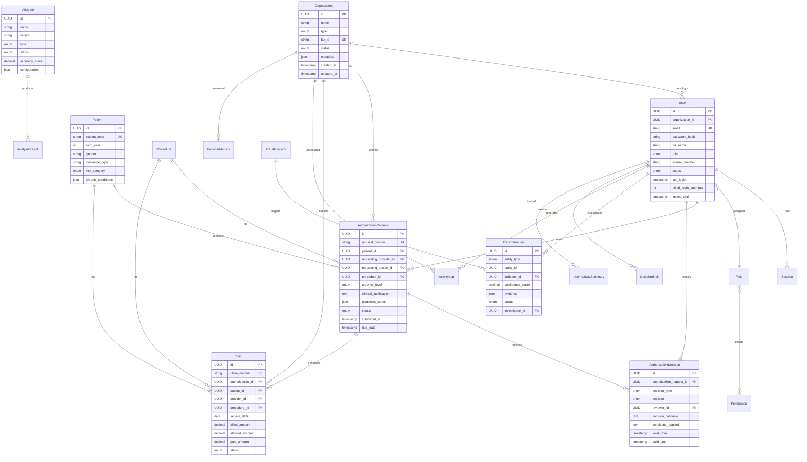

# AUSTA Cockpit Entity Relationship Diagram

## Entity Relationships



## Key Relationship Patterns

### 1. Organization Hierarchy
- Organizations employ Users
- Users inherit organization context for data access
- Organization type determines available features

### 2. Authorization Workflow
```
Patient → Authorization Request → Decision → Claim
         ↑                      ↑
    Provider/Doctor        Reviewer/AI
```

### 3. AI Analysis Pipeline
```
Entity (Auth/Claim/Patient/Provider)
    ↓
AI Model Analysis
    ↓
Analysis Result → Fraud Detection → Investigation
```

### 4. Audit Trail
```
Every User Action → Activity Log
Every Decision → Decision Trail
Every Violation → Compliance Record
```

## Cardinality Rules

### One-to-Many (1:N)
- Organization → Users
- User → Sessions
- Patient → Authorization Requests
- Authorization Request → Decisions
- AI Model → Analysis Results

### Many-to-Many (M:N)
- Roles ↔ Permissions (via role_permissions)
- Users ↔ Authorization Decisions (as reviewers)

### One-to-One (1:1)
- Authorization Decision → Authorization Request (current decision)
- User Activity Summary → User (per day)

## Data Integrity Rules

### Cascading Deletes
- User deletion → Sessions deleted
- Permission deletion → Role associations deleted
- Organization deletion → Users orphaned (set null)

### Restricted Operations
- Cannot delete Organizations with active Authorization Requests
- Cannot delete Procedures referenced by Claims
- Cannot modify completed Authorization Decisions

### Temporal Constraints
- Authorization validity periods must not overlap
- Claims service date must be within authorization validity
- Session expiry must be future timestamp

## Access Patterns

### Provider Access
- Can only view patients they have treated
- Can submit authorization requests for their patients
- Can view their organization's metrics

### Reviewer Access  
- Can view all pending authorizations
- Can make decisions on authorizations
- Cannot modify their own decision history

### Auditor Access
- Read-only access to all data
- Can flag compliance violations
- Can export audit reports

## Performance Considerations

### Hot Paths
1. Authorization lookup by status and date
2. User authentication and session validation
3. Real-time fraud detection queries
4. Provider performance aggregations

### Indexing Strategy
- Status fields for workflow queries
- Date ranges for reporting
- Foreign keys for joins
- Composite indexes for common filters