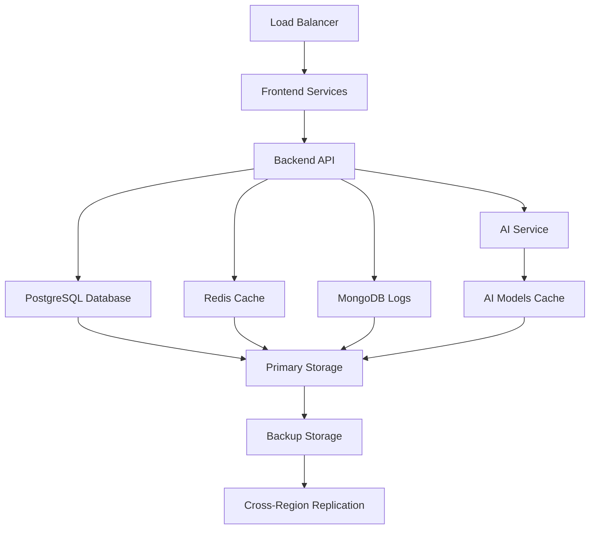

# AUSTA Cockpit Disaster Recovery Plan

## Table of Contents
1. [Overview](#overview)
2. [Recovery Objectives](#recovery-objectives)
3. [Service Dependencies](#service-dependencies)
4. [Recovery Priorities](#recovery-priorities)
5. [Recovery Procedures](#recovery-procedures)
6. [Testing Procedures](#testing-procedures)
7. [Communication Plan](#communication-plan)
8. [Post-Recovery Actions](#post-recovery-actions)

## Overview

This document outlines the disaster recovery procedures for AUSTA Cockpit, a comprehensive auditing and fraud detection platform. The plan ensures business continuity in the event of system failures, data corruption, security incidents, or infrastructure disasters.

### Scope
- **Systems Covered**: All AUSTA Cockpit infrastructure and applications
- **Data Covered**: All databases, application data, configurations, and user content
- **Recovery Scenarios**: Hardware failure, software corruption, cyber attacks, natural disasters

### Key Stakeholders
- **Primary Contact**: System Administrator
- **Secondary Contact**: DevOps Engineer
- **Business Contact**: Operations Manager
- **Technical Lead**: Senior Developer

## Recovery Objectives

### Recovery Time Objective (RTO)
- **Critical Services**: 2 hours
- **Core Services**: 4 hours
- **Non-Critical Services**: 24 hours

### Recovery Point Objective (RPO)
- **Database**: 15 minutes (point-in-time recovery)
- **Application Data**: 1 hour
- **Configuration**: 24 hours

### Service Level Objectives
- **Database Availability**: 99.9%
- **Application Availability**: 99.5%
- **Data Integrity**: 100%

## Service Dependencies

### Critical Dependencies


### Service Priority Matrix
| Service | Priority | RTO | RPO | Dependencies |
|---------|----------|-----|-----|--------------|
| PostgreSQL Database | Critical | 30 min | 15 min | Primary Storage |
| Backend API | Critical | 1 hour | 1 hour | Database, Redis |
| Frontend | High | 2 hours | 4 hours | Backend API |
| Redis Cache | High | 1 hour | 1 hour | - |
| MongoDB Logs | Medium | 4 hours | 4 hours | - |
| AI Service | Medium | 4 hours | 4 hours | AI Models |
| Load Balancer | High | 30 min | - | - |

## Recovery Priorities

### Phase 1: Immediate Response (0-30 minutes)
1. **Assess the situation**
   - Identify the scope and nature of the disaster
   - Determine which services are affected
   - Notify key stakeholders

2. **Activate disaster recovery team**
   - Assemble response team
   - Establish communication channels
   - Set up command center

3. **Preserve evidence**
   - Document the incident
   - Preserve logs and system state
   - Take screenshots/backups if possible

### Phase 2: Critical Service Recovery (30 minutes - 2 hours)
1. **Database Recovery**
   - Restore PostgreSQL from latest backup
   - Perform point-in-time recovery if needed
   - Verify data integrity

2. **Core Infrastructure**
   - Restore Docker infrastructure
   - Restart critical services
   - Verify service connectivity

### Phase 3: Full Service Recovery (2-24 hours)
1. **Application Services**
   - Restore all microservices
   - Verify integrations
   - Restore user data and configurations

2. **Monitoring and Alerting**
   - Restore monitoring systems
   - Verify alerting is functional
   - Update dashboards

## Recovery Procedures

### Infrastructure Recovery

#### 1. Complete Infrastructure Rebuild
```bash
#!/bin/bash
# Infrastructure recovery script

# Set environment variables
export RECOVERY_MODE=true
export BACKUP_DATE=${1:-$(date +%Y%m%d)}

# Create recovery directory
mkdir -p /recovery
cd /recovery

# Download infrastructure-as-code
git clone https://github.com/austa/infrastructure.git
cd infrastructure

# Run infrastructure provisioning
./scripts/provision-infrastructure.sh --recovery --backup-date $BACKUP_DATE

# Deploy application stack
./scripts/deploy-application.sh --recovery-mode
```

#### 2. Docker Infrastructure Recovery
```bash
#!/bin/bash
# Docker infrastructure recovery

# Stop all containers
docker stop $(docker ps -aq)
docker rm $(docker ps -aq)

# Remove all volumes (if corrupted)
docker volume rm $(docker volume ls -q)

# Recreate volumes
docker volume create postgres-data
docker volume create redis-data
docker volume create mongodb-data
docker volume create backend-uploads
docker volume create ai-models
docker volume create ai-cache

# Restore from backup
./docker/backup-scripts/restore-all.sh --date $BACKUP_DATE

# Start services in correct order
docker-compose up -d postgres redis mongodb
sleep 30
docker-compose up -d backend ai-service
sleep 30
docker-compose up -d frontend nginx-lb
```

### Database Recovery

#### 1. PostgreSQL Point-in-Time Recovery
```bash
#!/bin/bash
# PostgreSQL PITR recovery procedure

# Stop PostgreSQL service
docker stop austa-postgres

# Restore base backup
./docker/backup-scripts/restore-postgres-pitr.sh restore base_backup_20240118_020000 '2024-01-18 14:30:00'

# Start PostgreSQL in recovery mode
docker start austa-postgres

# Monitor recovery progress
docker logs -f austa-postgres

# Verify recovery completion
docker exec austa-postgres psql -U austa -d austa_db -c "SELECT pg_is_in_recovery();"
```

#### 2. MongoDB Recovery
```bash
#!/bin/bash
# MongoDB recovery procedure

# Stop MongoDB service
docker stop austa-mongodb

# Clear existing data
docker volume rm mongodb-data
docker volume create mongodb-data

# Restore from backup
./docker/backup-scripts/restore-mongodb.sh restore dump mongodb_dump_20240118_020000.tar.gz

# Start MongoDB
docker start austa-mongodb

# Verify restoration
docker exec austa-mongodb mongosh --eval "db.adminCommand('listCollections')"
```

#### 3. Redis Recovery
```bash
#!/bin/bash
# Redis recovery procedure

# Stop Redis service
docker stop austa-redis

# Restore from RDB backup
./docker/backup-scripts/restore-redis.sh restore rdb redis_rdb_20240118_020000.gz

# Start Redis
docker start austa-redis

# Verify data
docker exec austa-redis redis-cli INFO keyspace
```

### Application Recovery

#### 1. Backend Service Recovery
```bash
#!/bin/bash
# Backend service recovery

# Restore application configuration
./docker/backup-scripts/restore-application-configs.sh

# Restore uploaded files
./docker/backup-scripts/restore-uploads.sh

# Start backend service
docker-compose up -d backend

# Run health checks
curl -f http://localhost:3001/health || exit 1

# Verify database connectivity
curl -f http://localhost:3001/health/database || exit 1
```

#### 2. Frontend Recovery
```bash
#!/bin/bash
# Frontend service recovery

# Build and deploy frontend
docker-compose up -d frontend

# Verify frontend is accessible
curl -f http://localhost:3000 || exit 1

# Test critical user flows
./scripts/test-critical-paths.sh
```

#### 3. AI Service Recovery
```bash
#!/bin/bash
# AI service recovery

# Restore AI models cache
./docker/backup-scripts/restore-ai-models.sh

# Start AI service
docker-compose up -d ai-service

# Verify AI service health
curl -f http://localhost:8000/health || exit 1

# Test AI functionality
curl -f http://localhost:8000/api/v1/test || exit 1
```

### Network Recovery

#### 1. Load Balancer Recovery
```bash
#!/bin/bash
# Load balancer recovery

# Restore nginx configuration
cp /backups/configs/nginx-lb.conf /etc/nginx/

# Restart nginx
docker-compose restart nginx-lb

# Verify load balancing
curl -f http://localhost/health || exit 1
```

#### 2. SSL Certificate Recovery
```bash
#!/bin/bash
# SSL certificate recovery

# Restore SSL certificates
cp -r /backups/ssl/* /app/ssl/

# Update nginx configuration
docker-compose restart nginx-lb

# Verify HTTPS
curl -f https://localhost/health || exit 1
```

## Communication Plan

### Internal Communication
1. **Immediate Notification** (0-15 minutes)
   - Notify disaster recovery team via SMS/phone
   - Send initial status update via Slack/Teams
   - Contact management with initial assessment

2. **Regular Updates** (Every 30 minutes)
   - Progress updates to stakeholders
   - ETA updates for service restoration
   - Escalation if issues encountered

3. **Resolution Notification**
   - Services restored confirmation
   - Post-incident review scheduling
   - Documentation updates

### External Communication
1. **Customer Notification**
   - Status page updates
   - Email notifications for major incidents
   - Social media updates if applicable

2. **Vendor/Partner Notification**
   - Notify cloud providers
   - Inform third-party integrations
   - Contact support vendors

### Communication Templates

#### Initial Incident Notification
```
SUBJECT: [URGENT] AUSTA Cockpit Service Disruption

We are currently experiencing a service disruption affecting [SERVICES].

IMPACT: [DESCRIPTION]
ESTIMATED RESOLUTION: [TIME]
NEXT UPDATE: [TIME]

Our team is actively working to resolve this issue.

Status updates: [STATUS_PAGE_URL]
```

#### Resolution Notification
```
SUBJECT: [RESOLVED] AUSTA Cockpit Service Restored

All AUSTA Cockpit services have been fully restored.

RESOLUTION TIME: [TIME]
ROOT CAUSE: [SUMMARY]
PREVENTIVE MEASURES: [ACTIONS]

We apologize for any inconvenience caused.
```

## Testing Procedures

### Monthly Recovery Tests
1. **Database Recovery Test**
   - Restore from backup in test environment
   - Verify data integrity and completeness
   - Document recovery time and issues

2. **Application Recovery Test**
   - Deploy application from backups
   - Test critical user journeys
   - Verify integrations and functionality

3. **Infrastructure Recovery Test**
   - Rebuild infrastructure from code
   - Test network connectivity and security
   - Verify monitoring and alerting

### Quarterly Full Recovery Tests
1. **Complete Environment Recreation**
   - Build entire stack from scratch
   - Restore all data from backups
   - Perform end-to-end testing

2. **Recovery Time Validation**
   - Measure actual vs. target RTOs
   - Identify bottlenecks and improvements
   - Update procedures based on findings

3. **Team Training**
   - Run tabletop exercises
   - Train new team members
   - Practice communication procedures

### Annual Recovery Audit
1. **Plan Review and Update**
   - Review all procedures
   - Update contact information
   - Incorporate lessons learned

2. **Infrastructure Assessment**
   - Evaluate backup strategies
   - Review security measures
   - Assess recovery capabilities

3. **Business Continuity Validation**
   - Test alternate work locations
   - Verify vendor relationships
   - Update business impact analysis

## Post-Recovery Actions

### Immediate Actions (0-24 hours)
1. **Service Verification**
   - Comprehensive system testing
   - Performance validation
   - Security assessment

2. **Monitoring Setup**
   - Restore all monitoring systems
   - Verify alerting functionality
   - Set up enhanced monitoring for post-incident period

3. **Communication**
   - Notify all stakeholders of resolution
   - Provide initial incident summary
   - Schedule post-incident review

### Short-term Actions (1-7 days)
1. **Root Cause Analysis**
   - Conduct thorough investigation
   - Document findings and timeline
   - Identify contributing factors

2. **Preventive Measures**
   - Implement immediate fixes
   - Update procedures and documentation
   - Enhance monitoring and alerting

3. **Team Debrief**
   - Conduct lessons learned session
   - Update team training materials
   - Recognize team contributions

### Long-term Actions (1-4 weeks)
1. **Process Improvements**
   - Update disaster recovery procedures
   - Enhance backup and recovery systems
   - Implement additional safeguards

2. **Documentation Updates**
   - Update all technical documentation
   - Revise runbooks and procedures
   - Update training materials

3. **Testing and Validation**
   - Test all improvements
   - Validate updated procedures
   - Schedule additional training

## Appendices

### Appendix A: Emergency Contacts
| Role | Primary | Secondary | Phone | Email |
|------|---------|-----------|-------|--------|
| System Administrator | John Doe | Jane Smith | +1-555-0101 | admin@austa.com |
| DevOps Engineer | Bob Johnson | Alice Brown | +1-555-0102 | devops@austa.com |
| Database Administrator | Carol Wilson | Dave Miller | +1-555-0103 | dba@austa.com |
| Security Officer | Eve Davis | Frank Moore | +1-555-0104 | security@austa.com |

### Appendix B: System Credentials
- Stored securely in password manager
- Emergency access procedures documented separately
- Regular credential rotation schedule

### Appendix C: Vendor Contacts
- Cloud provider support numbers
- Third-party service contacts
- Hardware vendor information

### Appendix D: Recovery Checklists
- Detailed step-by-step procedures
- Verification checkpoints
- Rollback procedures

---

**Document Version**: 1.0  
**Last Updated**: $(date)  
**Next Review**: $(date -d '+3 months')  
**Owner**: AUSTA DevOps Team  
**Approved By**: CTO